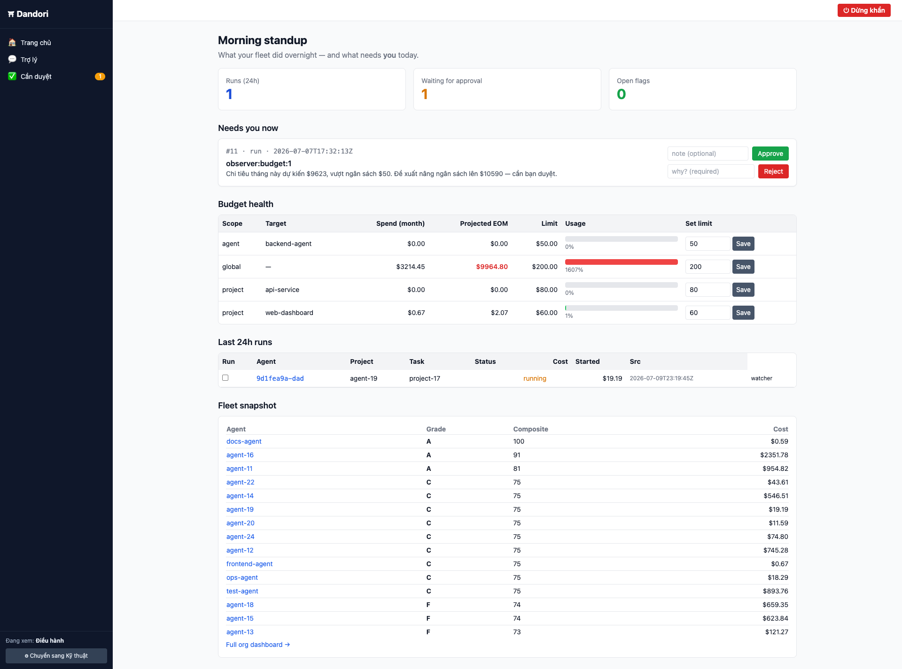

# Bắt đầu với Dandori

> Hướng dẫn cho người mới: từ zero đến "đội AI của bạn đang được ghi lại, gác, và chấm điểm".
> Mọi lệnh dưới đây là lệnh thật của binary — chạy `dandori <lệnh> --help` để xem cờ chi tiết.

Dandori là **một binary Go** bọc ngoài Claude Code. Nó không viết code thay bạn, không thay Claude Code — nó **ghi lại** mọi phiên agent, **chặn** hành động nguy hiểm ngay lúc chạy, và **chấm điểm** agent như chấm nhân sự. Ba trụ: CAPTURE · GOVERN · LEARN.

---

## Bước 0 — Build

```bash
go build ./cmd/dandori     # 1 binary pure-Go, không cần CGO
```

Ra file `./dandori`. Có thể copy vào `$PATH` (vd `~/go/bin/`) để gọi `dandori` ở mọi nơi.

## Bước 1 — Chạy console

```bash
./dandori serve
```

Console mở tại **http://127.0.0.1:4777**. Lần đầu, nó dẫn bạn qua trang **`/welcome`** với 3 bước thiết lập. `serve` cũng chạy nền: watcher (bắt run lọt hook), Jira sync, Slack worker.

Sau khi có vài run, trang standup (kỹ thuật) hoặc bảng điều hành (CEO) trông thế này — mọi con số đều có nút hành động đứng cạnh:



*(Xem thêm ảnh các trang khác ở [docs/03-features.md §Console thật trông thế nào](../03-features.md) và [docs/assets/screenshots/](../assets/screenshots/).)*

> Mặc định console chỉ nghe **localhost** — an toàn cho một máy. Muốn nghe LAN cần cấu hình `listen` khác + HTTPS (xem [admin guide](04-admin.md)).

## Bước 2 — Kết nối một dự án

Trong thư mục dự án bạn muốn quản (hoặc chỉ đường bằng `--project`):

```bash
dandori init --project ~/code/my-app --agent backend-agent
```

Lệnh này cài **4 hook** (SessionStart / PreToolUse / PostToolUse / Stop) vào `.claude/settings.json` của dự án — **merge, không phá hook sẵn có, idempotent** (chạy lại vô hại). Từ giờ:

- Mọi phiên Claude Code trong dự án **tự động được ghi lại** (ai · task · token · cost · code đổi · tool pass/fail).
- **Mọi tool-call đi qua guardrail engine** trước khi chạy.

Lặp lại `init` cho từng dự án bạn muốn đưa vào quản trị.

## Bước 3 — Tạo tài khoản đăng nhập (từ v10)

Khi chưa có tài khoản nào và console chạy trên localhost, bạn vào thẳng như cũ (chế độ local-trust). Để có **danh tính thật trong sổ audit** (ai duyệt, ai kill), tạo tài khoản admin đầu tiên:

```bash
dandori operator add <username> --role admin
```

Nhập mật khẩu 2 lần. Sau khi có ≥1 tài khoản, console **bắt buộc đăng nhập**. Thêm người khác:

```bash
dandori operator add alice --role viewer     # xem-only
dandori operator add bob   --role admin      # được duyệt/kill/mandate
```

> **Vai:** `admin` làm mọi thứ (duyệt, kill, đổi budget, mandate tri thức); `viewer` xem dashboard + đề cử (nominate) nhưng không duyệt được. Chi tiết [admin guide](04-admin.md).

## Bước 4 — Nối tích hợp (tuỳ chọn nhưng nên có)

Mở **`/settings/integrations`** trên console, dán token rồi bấm **Kiểm tra**:

| Hệ thống | Dùng để |
|---|---|
| **Jira** | Success metric lấy trạng thái done thật; tạo ticket từ run lỗi |
| **Slack** | Cảnh báo budget/flag; duyệt bằng reaction ✅/❌ |
| **OpenRouter** | Chat CEO-assistant + **AI-draft practice** (v13) |
| **GitHub / Google Workspace** | Auth qua CLI keyring (`gh auth`, `gws auth`) — không dán ở đây |

> **Sau khi nối lần đầu, khởi động lại `dandori serve`** — các worker nền bind config lúc boot.

## Bước 5 — Chạy thử

Chạy một phiên Claude Code bình thường trong dự án đã `init`. Xong quay lại console:

- **`/dash/org`** — leaderboard toàn đội, grade A–F.
- **`/runs`** — danh sách mọi run đã bắt.
- **`/insights`** — hiệu suất chi phí theo model/project.

Thấy run đầu tiên xuất hiện = thiết lập hoàn tất. Banner `/welcome` tự tắt.

---

## Bản đồ nhanh: bạn là ai?

| Bạn là | Đọc tiếp | Việc chính |
|---|---|---|
| **Engineer** dùng AI hàng ngày | [02-engineer.md](02-engineer.md) | Xem grade của mình, pull skill/kit, đề cử practice |
| **Manager / PO** | [03-manager.md](03-manager.md) | Review queue, duyệt, budget, mandate, leaderboard |
| **Admin / vận hành** | [04-admin.md](04-admin.md) | Operator/token, guardrail rule, RBAC, backup |
| Muốn hiểu **luồng tri thức** | [05-knowledge-flow.md](05-knowledge-flow.md) | mining → draft → publish → pull |
| Tra cứu **lệnh / trang / công thức** | [06-reference.md](06-reference.md) | Bảng đầy đủ |

---

## Sự cố thường gặp

- **Console đòi đăng nhập mà quên mật khẩu** → `dandori operator set-password <username>` (đổi mật khẩu, huỷ mọi session cũ).
- **Lỡ disable admin cuối cùng** → console khoá (không rơi về no-auth — đây là thiết kế). Mở lại bằng `dandori operator add` hoặc `set-password` từ shell.
- **Lệnh bị chặn với `[dandori G...]`** → guardrail đang gác. Xem lý do trong message; nếu là gate cần duyệt, vào `/reviews` hoặc reaction Slack. Muốn gỡ/sửa rule: [admin guide](04-admin.md).
- **Run không xuất hiện** → kiểm tra hook đã cài chưa: `grep dandori <project>/.claude/settings.json`. Chưa có thì chạy lại `dandori init`.
